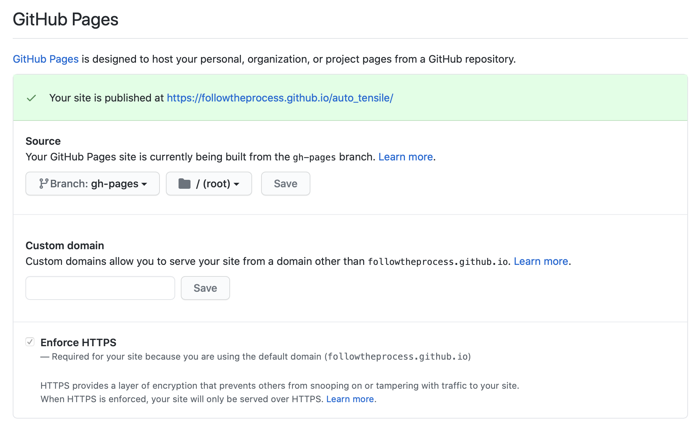

# Cookie Pypackage

My take on the cookiecutter pypackage project template. Inspired by the [original](https://github.com/audreyr/cookiecutter-pypackage/) with some tweaks.

I created it from scratch, taking inspiration from other templates mostly as a learning exercise. However, feel free to use it!

## Changes from the Original

* Changed from tox to nox automated testing

* Pytest only

* Changed from sphinx to mkdocs

* Removed readthedocs in favour of github pages

## Features

* [Travis-CI](https://travis-ci.com): Ready for Travis CI testing.

* [Nox](https://nox.thea.codes/en/stable/): Automated testing for python 3.6+

* [Mkdocs](https://www.mkdocs.org): Easy markdown docs with Mkdocs, mkapi, and github pages.

* [bump2version](https://github.com/c4urself/bump2version): Pre-configured version bumping with a single command

* Auto-release to [PyPI](https://pypi.org) when you push a new tag to master

## How to Set up GitHub Pages

This template is designed such that the docs (mkdocs) will be automatically built and served on github pages on each successful travis build.

In order to make this work though you must follow these steps on your GitHub Repo:

*GitHub has excellent documentation on using GitHub pages [HERE](https://docs.github.com/en/free-pro-team@latest/github/working-with-github-pages)*

1) Generate a GitHub [personal access token](https://docs.github.com/en/free-pro-team@latest/github/authenticating-to-github/creating-a-personal-access-token)

2) Take this token and put it in your [environmental variables](https://docs.travis-ci.com/user/environment-variables/) in your travis repo settings. The name is very important, name it `GITHUB_TOKEN`.

3) After the first push or merge to master, the docs should have been built by travis and can be found on the gh-pages branch.

3) Point your GitHub pages settings to the root folder of this branch (if it isn't already automatically)...

4) That should be it! After a few minutes your docs will be available on GitHub Pages.
